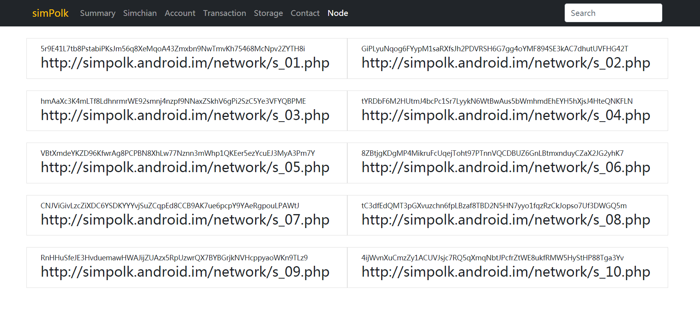

# W3F Open Grant Proposal

* **Project Name:** simPolk

* **Team Name:**   Fuu

* **Payment Address:**  0xF8105ea1cC3130501bad5De60Bd3D794a9115dE2 (USDT)

  

## Project Overview :page_facing_up:

### Overview

* simPolk is a simulator for Polkadot，帮助从未接触过区块链开发的开发者，快速理解区块链及Polkadot，快速构建波卡应用，已经发布的0.1版本。
* 波卡已经把区块链开发变得简单和模块化了，但使用门槛仍然很高。一个刚开始区块链的开发者，需要熟悉很多全新的概念，同时，搭建一个可用的区块链网络也是一项巨大的工程。由于波卡的开发在快速迭代，仅仅维持软件的版本，都需要花费大量的精力及面对各种编译出错。
* 自己作为从web开发转到区块链技术的编程人员，经历了这个耗时耗力的痛苦过程，面临过巨大的挑战，从学习Rust到调试substrate，从增加Pallet到升级substrate版本，花费了大量的时间和精力，然而，问题并没有得到很好的解决，请看[虚块世界](https://github.com/ff13dfly/VirtualBlockWorld)。而应用的产品设计及开发，都依赖于稳定的区块链网络。
* 某天，豁然开朗，就诞生了这个项目，simPolk(波卡模拟器)，抛弃掉建立私链所需要的多种技能，只需要简单的拷贝代码，配置系统，就可以模拟大部分的私链行为。而且，simPolk是单机模拟器，不需要任何网络支持，即可对波卡的开发进行熟悉。把应用开发者从区块链的底层解救出来，专注于应用程序的开发。
* 未来，再通过一个网关，也能将应用程序直接切换到真实的波卡网络中去，这样，可以循序渐进的进行波卡应用程序的开发。

### Project Details

* simPolk是一套完整的区块链模拟器，可以在单台主机上模拟区块链的行为，包括区块的生成、区块的结构、交易的结构、链上存储的结构、智能合约的结构。这些结构以JSON的方式进行解析，方便阅读和使用。这些都来自于simPolk的设计理念，快速的阅读，快速的理解，快速的使用，在10分钟之内，就可以初步理解区块链涉及到的重要技术点，着手构建你自己的应用程序。
* 目前，simPolk已经发布了0.1版本，演示网站是http://simpolk.android.im/ui，Github是 https://github.com/ff13dfly/simPolk 。
* 基于简单使用的考虑，simPolk使用php语言开发，使用redis作为数据存储引擎，调用部分使用jsonp方式进行跨域访问。新版本考虑支持文件保存，更利于检查数据状态。
* simPolk用模拟的方式返回和Polkadot一致的数据结构，这样，对于理解UTXO、区块结构、Merkle树等核心概念，提供了直观的数据结果。您也可以通过JSONP的方式，直接调用simPlok的API部分，尝试快速的进入Polkadot的开发，边用边学，渐入佳境。
* simPolk用单一的php文件来模拟服务器，您可以快速的搭建一个虚拟网络，来观察挖矿过程，直观的体验每一笔coinbase的生成，每笔交易的merkle树生成。
* simPolk用单一的php文件来模拟波卡的pallet，可以快速的构建产品原型，优化产品。

### Ecosystem Fit

* 波卡生态圈就是能吸纳更多的开发者，开发更多基于波卡的应用，但是新的开发者面临着系统框架理解和开发语言两大障碍，simPolk通过简单易用的php来模拟波卡网络，帮助开发者快速跨越这两个障碍。
* 作为一个应用开发者，对波卡所描述的未来非常认同，就着力于基于波卡进行应用的开发（虚块世界）。但自己的技术栈是php+js，一个常见的web开发者，我知道，还有大量的像我一样的开发者。像我这样的开发者，对于编译型语言的开发，学习曲线陡峭，很容易在初期，就被阻挡在区块链开发之外。而区块链又是一个复杂的技术，各种概念都是日常开发中很少接触的。
* 自己在开发simPolk的过程中，对于区块链的结构，UTXO，智能合约等重要的区块链概念，也有了更深刻的理解。尤其是simPolk开发了悬停模拟网络的功能，可以静态的观察模拟网络，理解各个数据项之间的关系，这对充分理解波卡是非常有帮助。
* 查看了Polkadot的官方支持项目，目前没有发现类似项目。当前解决开发者的方式是完全开源，并提供了大量的测试网络，但复杂程度太高，新开发者需要花费大量的时间，才能上手构建自己的应用。
* 熟练使用simPolk之后，可以先基于simPolk进行原型开发，极大的提升了开发效率，自己就在虚块世界的开发中使用了这个方法，快速的解决了几个难题，都是有关区块链开发和基于数据开发的不同导致的。

## Team :busts_in_silhouette:

### Team members

* Zhongqiang Fu 

### Contact

* **Contact Name:** Zhongqiang Fu
* **Contact Email:** ff13dfly@163.com
* **Website:** https://github.com/ff13dfly/simPolk

### Legal Structure

* Individual.

### Team's experience

个人的开发经验主要集中在非区块链开发部分，正因为想开发基于波卡的应用，就产生了simPolk这个项目。

* 虚块世界 ( https://github.com/ff13dfly/VirtualBlockWorld )，基于波卡的虚拟世界。将会采用全链上结构，形成3D价值虚拟世界。

* Jeditor ( https://github.com/ff13dfly/Jeditor )，简单易用的json编辑器。只需一个引用，就可以快速的编辑json数据，该编辑器也用于simPolk的UI开发中。

* simPolk ( https://github.com/ff13dfly/simPolk )，波卡区块链模拟器。基于php，可以单机模拟区块链行为的辅助开发工具。

### Team Code Repos

* https://github.com/ff13dfly/VirtualBlockWorld

* https://github.com/ff13dfly/Jeditor

* https://github.com/ff13dfly/simPolk

  

## Development Status :open_book:

* 目前的simPolk已经完成了0.1版本，你可以同过以下方式进行了解。
  * simPolk的Demo网站 [http://simpolk.android.im/ui/]()
  
  * simPolk的github  [https://github.com/ff13dfly/simPolk]()

    
  
* 程序结构

  * simPolk贯彻简单易用的原则，并未使用任何php的框架，实现区块链模拟部分只有一个php文件，方便理解和阅读

  * simPolk程序文件（simPolk/API/）结构如下：

    | 目录  | 文件名              | 功能描述                                                   |
    | :---: | ------------------- | ---------------------------------------------------------- |
    | ./lib | core.class.php      | 存储及基础功能类，目前使用redis对模拟链数据进行保存        |
    | ./lib | simulator.class.php | 模拟链实现类，UTXO、区块结构等核心模拟部分，都在这个文件里 |
    | ./sim | account.class.php   | 接口类，账户创建及查询功能                                 |
    | ./sim | chain.class.php     | 接口类，转账及区块查询功能                                 |
    | ./sim | contact.class.php   | 接口类，智能合约功能                                       |
    | ./sim | node.class.php      | 接口类，模拟节点查询功能                                   |
    | ./sim | sample.class.php    | 接口类，开发pallet的sample                                 |
    | ./sim | storage.class.php   | 接口类，链上存储创建及查询功能                             |
    |  ./   | config.php          | json格式的系统运行配置文件                                 |
    |  ./   | entry.php           | 外部调用请求入口                                           |

    

  * simPolk的路由规则，以下url请求的说明：

    `entry.php?mod=account&act=list&p=3&callback=?`

    | 参数     | 值      | 说明                                                         |
    | :------- | ------- | ------------------------------------------------------------ |
    | mod      | account | 路由值，必须，调用sim/{mod}.class.php文件                    |
    | act      | list    | 路由值，必须，调用{mod}.class.php里task方法，通过{act}路由到指定方法 |
    | callback | ?       | 回调，非必须，JSONP使用的参数                                |
    | p        | 3       | 参数，非必须，更多需要传递给处理方法的参数                   |

    

  * simPolk的数据存储，采用redis（kv数据库）进行数据保存，后期将可选的使用文件进行保存，更方便的进行数据结构的观察。

    

* UI说明

  * 模拟链的配置，可以对模拟链悬停、出块速度、虚拟币名称、挖矿奖励等进行配置。其中一个重要的功能是对模拟链进行悬停操作，使用该功能后，模拟链将停止区块的生成，便于观察区块链的状态及进行链上操作。

    

    

  * 模拟链的数据浏览，可以显示模拟链的当前状态，浏览指定区块的数据（JSON方式），查看已收集的交易、存储和智能合约的状态。

    

    

  * 模拟链的账号管理，可以显示模拟链所有用户的列表，搜索指定用户的详情，搜索指定的可用input的详情。

    

    

  * 模拟链的转账功能，向指定的目标账户进行转账操作，搜索指定的可用input的详情。

    

    

  * 模拟链的公共储存，用指定的账号添加链上存储，搜索指定的储存数据详情。

    

    

  * 模拟链的智能合约，用指定的账号添加智能合约，搜索指定的智能合约。

    

    

  * 模拟链的虚拟节点，模拟节点列表。

    

* 帮助文档，将完成以下几部分的使用说明，便于开发者理解和使用simPolk。

  * simPolk的使用说明
  * 模拟链的配置说明
  * 模拟链的节点配置
  * 模拟链的API说明

## Development Roadmap :nut_and_bolt:

* simPolk的单机模拟器帮助开发者熟悉区块链及波卡开发，再通过网关连接到平行链，帮助开发者实现应用的快速上链。

  * 单机模拟的实现

    

  * 网关上链的实现

  

  

* simPolk由三部分构成：API，UI，Node

  * API部分，实现模拟链的基础功能及API接口的功能。
  * UI部分，对模拟链进行操作的管理界面。
  * Node部分，模拟链的网络节点功能。

* simPolk的目标是想让web开发者，10分钟就能理解波卡开发，就能开始动手构建自己的应用程序。 使用php进行开发，区块链模拟方法为simulator.class.php。

  

### Overview

* **Total Estimated Duration:** 3 months

* **Full-Time Equivalent (FTE):**  4 FTE

* **Total Costs:** 24,000 USD

* simPolk的本次开发，主要解决数据结构的匹配、模拟智能合约实现这两个方面。之后，将尝试应用到虚块世界，理解开发需求，为下一步从模拟器到网关的开发打好基础。

  

### Milestone 1 : Data structure simulation

* **Estimated duration:** 1 month
* **FTE:**  1FTE
* **Costs:** 6,000 USD

simPolk已经完成了区块链的框架开发，但是数据结构和波卡网络有很大的差别，需要理解波卡Kusama网络的区块结构，进行逐步修正。目的是为了让模拟链的数据结构以及数据类型同真实的波卡网络一致，这样，就可以给开发者更真实的体验，同时，为后继模拟链网关的数据打通提供支持。

| Number | Deliverable   | Specification                                                |
| :----- | ------------- | ------------------------------------------------------------ |
| 0a.    | License       | Apache 2.0                                                   |
| 0b.    | Documentation | 将提供使用说明、数据结构的说明                               |
| 0c.    | Testing Guide | 将对api/lib/simulator.class.php文件的功能进行单元测试，提供单元测试代码 |
| 0d.    | Docker        | We will provide a Dockerfile(s) that can be used to test all the functionality delivered with this milestone. |

### Milestone 2 : Smart contact function

* **Estimated duration:** 1 month
* **FTE:**  2FTE
* **Costs:** 12,000 USD

完成对智能合约的模拟，做到让simPolk的使用者明白智能合约的运行原理，并可以编写和运行模拟的智能合约，更好的设计开发者自己应用的智能合约。

| Number | Deliverable   | Specification                                                |
| :----- | ------------- | ------------------------------------------------------------ |
| 0a.    | License       | Apache 2.0                                                   |
| 0b.    | Documentation | 提供智能合约创建、执行的说明文档，提供智能合约如何模拟实现的说明 |
| 0c.    | Testing Guide | Core functions will be fully covered by unit tests to ensure functionality and robustness. In the guide, we will describe how to run these tests. |
| 0d.    | Docker        | We will provide a Dockerfile(s) that can be used to test all the functionality delivered with this milestone. |

### Milestone 3 : Application integration 

* **Estimated duration:** 1 month

* **FTE:**  1FTE

* **Costs:** 6,000 USD

将虚块世界的数据请求，切换到simPolk上来，用于验证simPolk是否可以对应用开发起到帮助作用。验证simPolk的模拟功能可以帮助应用开发验证数据结构、智能合约，可以快速的加入波卡生态。

| Number | Deliverable   | Specification                                                |
| :----- | ------------- | ------------------------------------------------------------ |
| 0a.    | License       | Apache 2.0                                                   |
| 0b.    | Documentation | 提供虚块世界集成的php类文件，详细说明如何实现功能。          |
| 0c.    | Testing Guide | Core functions will be fully covered by unit tests to ensure functionality and robustness. In the guide, we will describe how to run these tests. |
| 0d.    | Docker        | We will provide a Dockerfile(s) that can be used to test all the functionality delivered with this milestone. |

## Future Plans

* 会将simPolk应用在虚块世界这个项目上，验证功能的合理性。

* 不久的未来，将假设simPolk的网关，以kv的方式，接入波卡网络，实现模拟网功能到真实波卡网络的快速切换，仅需配置必要的参数，就可以参与到波卡生态中去。

  

## Additional Information :heavy_plus_sign:

**How did you hear about the Grants Program?**  Web3 Foundation Website .

* 2020年提交[虚块世界](https://github.com/ff13dfly/VirtualBlockWorld)到Open Gant Application，当时的metaverse概念并未得到广泛认可，未能得到赞助。

